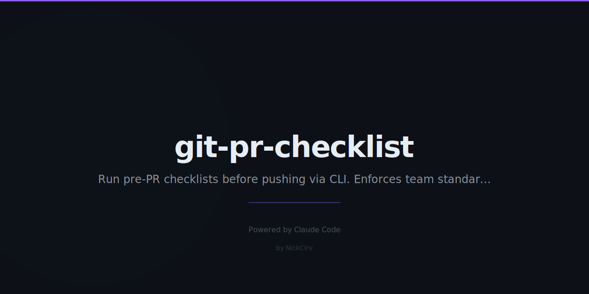

# git-pr-checklist

> Run a pre-PR checklist before pushing — enforce team standards and catch common mistakes.

Zero external dependencies. Pure Node.js ES modules. Works with any project.

## Install

```sh
npm install -g git-pr-checklist
```

Or use directly without installing:

```sh
npx git-pr-checklist init
npx git-pr-checklist
```

## Quick Start

```sh
# 1. Add a config to your project
prc init

# 2. Edit .pr-checklist.json to match your project

# 3. Run before every PR
prc
```

## Usage

```
prc [options]            Run all checks
prc init                 Create .pr-checklist.json with example checks
prc install-hook         Install as git pre-push hook (runs prc on every push)
prc --help               Show help
```

### Options

| Flag | Description | Default |
|------|-------------|---------|
| `--base <branch>` | Base branch to diff against | `main` (or config value) |
| `--config <path>` | Path to config file | `.pr-checklist.json` |
| `--interactive` | Prompt to override failed checks | off |

## Configuration

Create `.pr-checklist.json` in your project root (`prc init` generates an example):

```json
{
  "base": "main",
  "checks": [
    { "name": "No console.log",       "type": "no-console-log" },
    { "name": "No TODO/FIXME",        "type": "no-todo",         "warn": true },
    { "name": "Tests pass",           "type": "tests-pass",      "command": "npm test" },
    { "name": "Build passes",         "type": "build-passes",    "command": "npm run build" },
    { "name": "Branch convention",    "type": "branch-name",     "pattern": "^(feat|fix|chore)/.+" },
    { "name": "Max 10 commits",       "type": "commit-count",    "max": 10,  "warn": true },
    { "name": "Max 30 files changed", "type": "files-changed",   "max": 30,  "warn": true },
    { "name": "No secrets in diff",   "type": "no-secrets" },
    { "name": "Lint",                 "type": "custom",          "command": "npm run lint" }
  ]
}
```

## Check Types

| Type | Description | Options |
|------|-------------|---------|
| `no-console-log` | Scan changed JS/TS files for `console.log` | `warn` |
| `no-todo` | Scan changed files for `TODO` or `FIXME` | `warn` |
| `tests-pass` | Run test command, check exit code | `command` |
| `build-passes` | Run build command, check exit code | `command` |
| `branch-name` | Regex test on current branch name | `pattern`, `warn` |
| `commit-count` | Max commits since base branch | `max`, `warn` |
| `files-changed` | Max files changed since base branch | `max`, `warn` |
| `no-secrets` | Scan diff for leaked credentials | — |
| `custom` | Run any shell command | `command`, `warn` |

### `warn` flag

Set `"warn": true` on any check to emit a warning instead of a failure. Warnings do not cause a non-zero exit code.

## Output

```
git-pr-checklist
branch: feat/my-feature  base: main  commits: 3  files: 7

  ✅  PASS  No console.log
  ⚠️   WARN  No TODO/FIXME
  ❌  FAIL  Tests pass
  ✅  PASS  No secrets in diff

──────────────────────────────────────────────────
  2 passed  1 failed  1 warned

❌ 1 check(s) failed. Fix before pushing.
```

Exit code `0` = all checks passed (warnings are OK). Exit code `1` = at least one FAIL.

## Pre-push Hook

Install as a git hook so it runs automatically on every `git push`:

```sh
prc install-hook
```

This writes a `pre-push` hook to `.git/hooks/pre-push`.

## Interactive Mode

```sh
prc --interactive
```

When checks fail, you'll be prompted to override each one individually. Useful for escape-hatch situations without removing the check entirely.

## Secret Detection

The `no-secrets` check scans the diff (not full files) for common credential patterns:

- OpenAI keys (`sk-...`)
- GitHub tokens (`ghp_...`)
- AWS access keys (`AKIA...`)
- Slack bot tokens (`xoxb-...`)
- Google API keys (`AIza...`)
- PEM private keys

## Security

- No `exec` or `execSync` — all subprocesses use `spawnSync` / `execFileSync` with explicit arg arrays
- No shell expansion on user-supplied input
- Secrets never logged or stored

## License

MIT
